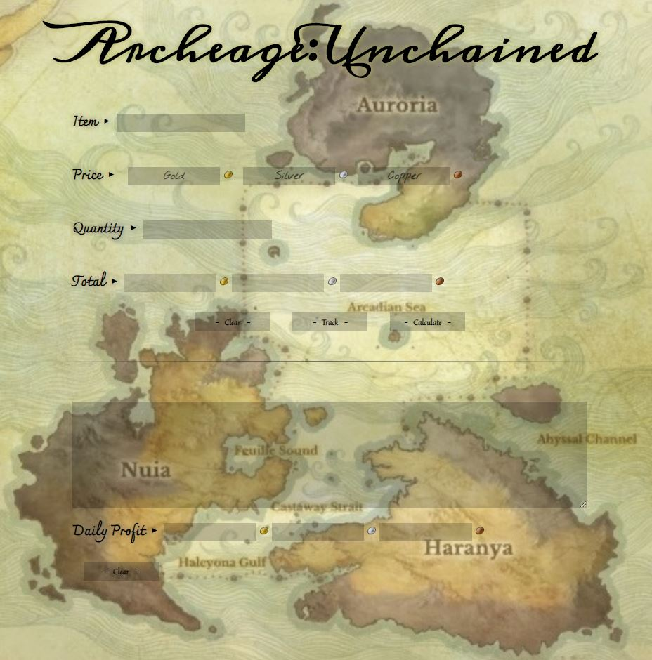

<h1 align="center">MMORPG Profit Calculator</h1>
<h3 align="center"> 
<a href="https://xerilius.github.io/mmorpg-profit-calculator/">「 L I V E &nbsp; D E M O 」</a>
</h3>

<b><ins>BUILT WITH</ins></b>  
 

  

### Version 2.0 
* Graph showing profit inc/dec
